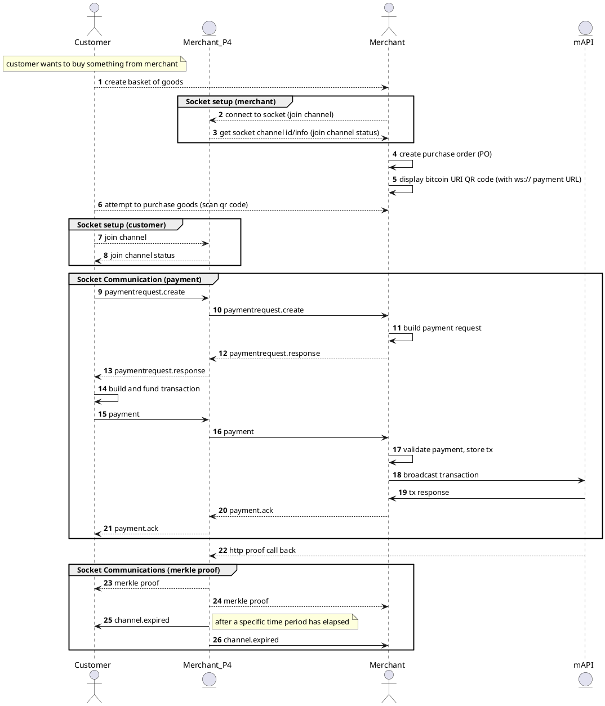

# Websocket Model (using a P4 server as a proxy)

This setup just uses websockets all through (on the customer/sender side as well). This is a new setup that most other wallets in the ecosystem are not used to or have not seen before. Basically, the customer and merchant communicate with each other using websockets for the entire P4 flow with the P4 server acting as a proxy between them. The reason why the P4 server is needed is the same reasoning as above: because the merchant will not always be externally accessible over the internet.

## Channel setup

Each invoice payment flow would be achieved with a unique web socket 'channel', i.e. communication will occur on a common channel, setup by the merchant and communicated to the payer. This channel could be secured with a token or other mechanism but to start with it will be open.

All comms will happen in real time until the point the channel is killed by the merchant (usually once merkle proofs have been sent).

PayD HTTP Endpoints
-------------------

In order to facilitate a "merchant" setting up a socket channel a new endpoint is required on PayD.

### POST /connect/:invoiceID

Used to create and connect a wallet to a p4 socket server payment channel.

### Request Body

None

### Response Body

Status Code : 204 - no content on success

500 on failure

P4 HTTP Endpoints
-----------------

P4 requires a new endpoint to accept proofs, in the socket comms it will then propagate this proof to the relevant payment channel to any entity still listening, at this point both the sender and merchant should be waiting for the proof.

After a time period, default being 2 hours, the P4 server will then issue a channel.expired message and close the payment channel. This should give enough time of any proofs to be sent for subsequent splits in the chain if that happens.

### POST /proofs/:txid?i=invoiceID

Receives a merkle proof callback from mAPI

#### Request Body

TSC Merkle Proof format in a JSON Envelope

[?](#)

`{`

`"payload"``:` `"{\"callbackPayload\":{\"index\":12125,\"txOrId\":\"ee084ac6dc08ad6a4ff416596d8710d3fe8fd62688e35175b8558666d34bead0\",\"target\":\"00000000000000000bf85b54d7fba423d292e51f16073b80db1279148c165f59\",\"nodes\":[\"3534fa80cb128b092be1a583232e8fa6ecfe1d3c6ff0df889aeaa85f6bd7b5b7\",\"a806dd23ff2d6533e9af2abec2ad9866ab3bbe37aeacc1d10faa28ec0aa83593\",\"645b9213da06854fbf208f27e40b0846e4baf31bcac52a2a4e84340914daf513\",\"514ec3b1245d027c43d1cfaf9b8e834549e66cac5701eb21549e95d3e4632a1d\",\"9b5c3103bbe0dbb7fee24ce783752c4f5e8400f5db0f5fc4b98ab910f2ff4238\",\"06e3ae42a4fbcc398114e52d439fb2b3230dae6d774a518558174c7d852dfe8f\",\"86161db54a439a627aee4e3d82df52895f3607d55c8f940c1c3b1de95cd402c0\",\"2f6ea6cc4ad1b277a43003ffef64f4ba5ad7cbfc2cee71abe790a6d3db80a540\",\"d39eff30d896a30eb71150679db8372fb63cf62248cf1fa161adaf6f184002d4\",\"8244a9737b7358f9daa4d19ba3cb11ebe44abd22ffcb8bf364c12a6d2e0cf7ea\",\"33edb055f86d6cebeb409b8462a2933bf46889e2911285fae2b8f1611dad4f08\",\"fdf0f082155b04db600f35ce7c7dd323eb2c4664ee088ab1d434fb488e267a30\",\"e4174c4bf2b7c61b6187ed36fdf9023159eb1e2868777819ff58702e145c909d\",\"f84bcb26c2daa88a9f7327f0a26e2521815fc526211ced914e9df346a98856d7\"]},\"apiVersion\":\"1.3.0\",\"timestamp\":\"\",\"minerId\":\"\",\"blockHash\":\"00000000000000000bf85b54d7fba423d292e51f16073b80db1279148c165f59\",\"blockHeight\":707873,\"callbackTxId\":\"ee084ac6dc08ad6a4ff416596d8710d3fe8fd62688e35175b8558666d34bead0\",\"callbackReason\":\"merkleProof\"}"``,`

`"signature"``:` `"3045022100fee677787411922b13bb4830873a2d555d65d691a688926c6dddb6bca55ffc460220379c57fbe84a2f18edfe0e90662b276c02adc2c00e41141485cb24642b479a0b"``,`

`"publicKey"``:` `"035a10273013d7a8fd74a1f60d162bad798cb7e352c1f747cca16b8627ff859242"``,`

`"encoding"``:` `"UTF-8"``,`

`"mimetype"``:` `"application/json"`

`}`

#### Response

StatusCode: 201

400 - invalid format received / proof not for requested tx

No body

### GET /ws/:channelID

Used for clients to join a channel - this then upgrades the connection to a websocket connection and waits for the channel to close while broadcasting any messages.

A websocket url is used to connect ie ws://p4/ws/abc123

#### Request

No Body

#### Response

Status Code - 200

500 - unknown error

Socket Messages
---------------

All socket messages use a standard format, with different bodies supplied, much like an http request.

The format for each message sent is shown, messages are encoded to JSON:

### Socket message Wrapper

  

[?](#)

`{`

`"id"``:` `"uuid"`

`"key"``:` `"namespace.type.action"``,`

`"body"``: {},`

`"messageId"``:` `"abc123"``,`

`"correlationID"``:` `"abc123"``,`

`"timestamp"``:` `"2019-10-12T07:20:50.52Z"` `// RFC3339,`

`"headers"``: {`

`"myheader"``:` `"value"`

`}`

`"expiration"``:` `"2019-10-12T07:20:50.52Z"` `// RFC3339,`

`"channelID"``:` `"abc123"``,`

`"appId"``:` `"p4/payd"``,`

`"userId"``:` `""`

`}`

The body will then have each message bytes encoded, for example, a payment request response body would be encoded there. The client will know the message type and how to handle based on the key.

ChannelID identifies the channel, which in this case is an invoiceID.

### Socket Error Message

In the event of an error occurring it can be returned to the sender in a special message wrapper:

[?](#)

`{`

`"id"``:` `"uuid"``,`

`"key"``:` `"error"``,`

`"originKey"``:` `"original.key"``,`

`"originBody"``: {}`

`"errorBody"``: {`

`"title"``:` `"thing failed"``,`

`"description"``:` `"unable to find thing"``,`

`"errCode"``:` `"abc123"`

`},`

`"messageId"``:` `"abc123"``,`

`"correlationID"``:` `"abc123"``,`

`"timestamp"``:` `"2019-10-12T07:20:50.52Z"` `// RFC3339,`

`"headers"``: {`

`"myheader"``:` `"value"`

`}`

`"expiration"``:` `"2019-10-12T07:20:50.52Z"` `// RFC3339,`

`"channelID"``:` `"abc123"``,`

`"appId"``:` `"p4/payd"``,`

`"userId"``:` `""`

`}`

  

This contains the original key and message as well as the error detail for handling. At the moment we don't retry on fail, we just log it, but messages could be retried for example.

### Messages

Much like http where we have endpoints that determine resource types and how to handle messages received, we have message keys which act as an endpoint would. They identify a resource, by reading the message key, we know how to handle the message.

All messages are listed below:

| Type | Description | Body |
| --- | --- | --- |
| Type | Description | Body |
| --- | --- | --- |
| join.success | Received in response to a client connecting to the socket server | none |
| paymentrequest.create | Requests a new Payment Request object to allow the sender to construct a transaction to pay the invoice. | none - channelID in the wrapper is sufficient |
| paymentrequest.response | Payment request response as defined in the spec, sent from the merchant to the sender with destionations etc | bip270 Payment Request response |
| payment | Payment that should fully pay the payment request above | Bip270 payment with spv envelope etc |
| payment.ack | Success / Failure response sent from merchant to sender after validation and broadcast. A failure could indicate an invalid tx, double spend attempt / mapi failure etc | Bip270 payment ack message, with payment included in response |
| proof.create | Contains a TSC proof wrapped in a json envelope, sender and merchant will add to their data stores to allow them to build spv envelopes. | mAPI Merkle Proof callback TSC format |
| channel.expired | Message sent from P4 to payd after the channel has expired. | none |