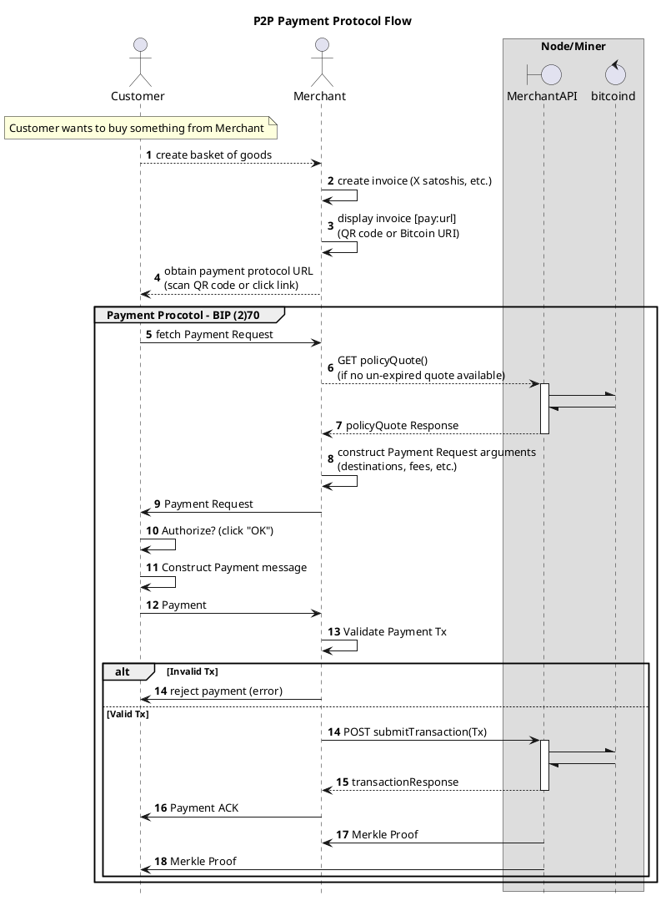
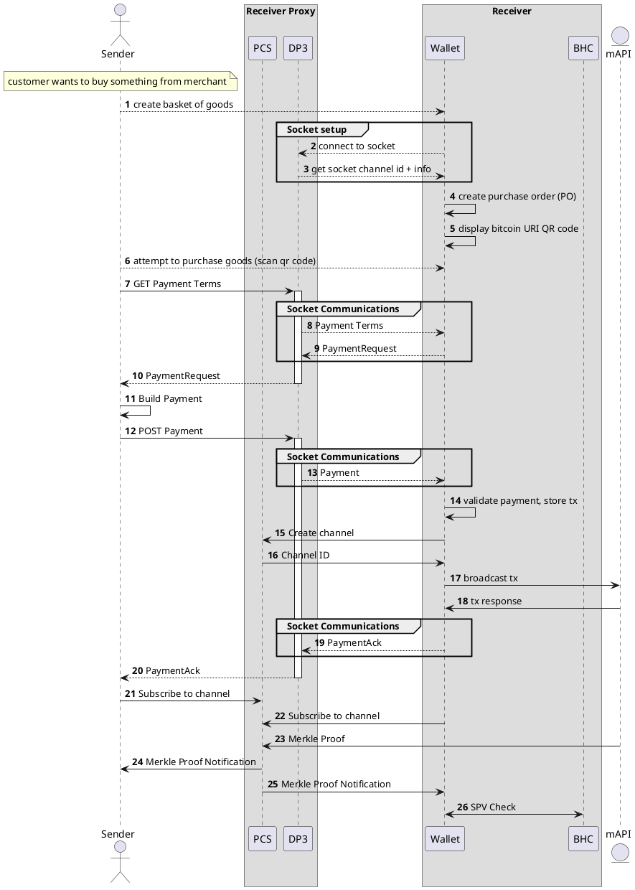

# System Designs

## Basic HTTP/REST Model

This is the basic DPP (Direct Payment Protocol) model, previously known as BIP270, where the payment flow is done peer-to-peer instead of peer-to-blockchain-to-peer.

> Please note that the merchant should use TLS/HTTPS when exposing their Bitcoin URI in order for the customer to be secure against a MITM (man in the middle) attack.

## Advanced REST/HTTP Model (using REST API externally + websockets internally) 

There exists a limitation with the above basic REST/HTTP model: namely that the merchant/receiver must be externally accessible on the internet. For example if you run your wallet on you laptop connected to the internet through your home WiFi router connection, you won't be able to receive payments as detailed above. This is because you will likely be using IPv4, where there aren't enough addresses for everyone in the world (unlike IPv6), so your laptop's IP address will probably be an internal/private IP address that gets packets forwarded to it by the router using NAT (network address translation). Unless your computer is using a public IP address that is publicly accessible, you won't (easily) be able to do this. Another issue is that connecting to a base IPv4 address is not secure against MITM (man in the middle) attacks since there is no authentication involved. To combat this you will need TLS/HTTPS for authentication as mentioned above.

This setup is little more advanced than the basic flow above. Externally (from the sender/customer's point of view) it looks identical to the basic flow, however internally (under the hood, between the merchant's wallet and the merchant's P4 server) websockets are used. Here the merchant's P4 server is hosted somewhere externally accessible on the internet (using TLS/HTTPS) while the merchant can run their wallet anywhere. When the merchant's wallet starts up, it will connect to the P4 server and create a websocket connection to it. Then, it will use that socket channel id when exposing/displaying its Bitcoin URI so that when the customer hits the P4 server, the P4 server will know where to send a message over the websocket and then get a message back from the merchant's wallet with the `PaymentRequest` and then the P4 server will respond to the REST API call with that.

